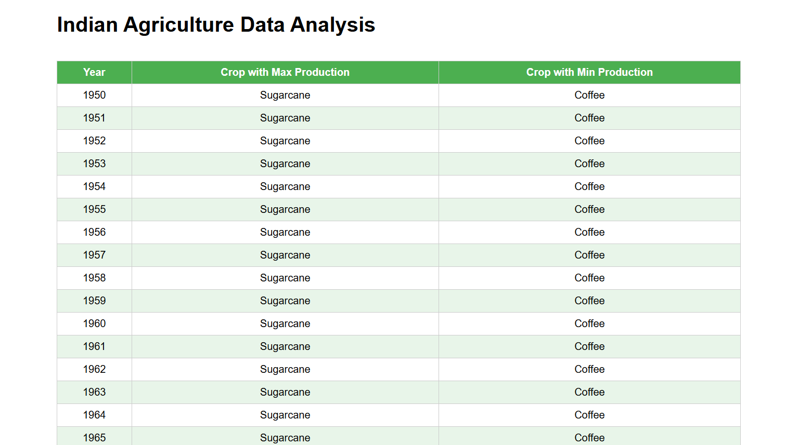
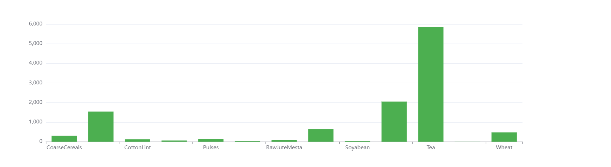

# Indian Agriculture Data Analysis

A simple React + TypeScript + Vite project that processes and visualizes Indian agriculture data.

## Features
- Displays max/min crop production by year in a table
- Shows average crop yields in a bar chart
- Fetches data from a JSON file (public/agricultureData.json)

## Setup & Running
1. Install dependencies:  
   yarn install  
   or  
   npm install  
2. Start dev server:  
   yarn dev  
   or  
   npm run dev  
3. Open http://localhost:5173 in your browser.

## Project Structure
<pre>
├─ public
│  └─ agricultureData.json
├─ src
│  ├─ components
│  │  ├─ DataTable.tsx
│  │  └─ BarChart.tsx
│  ├─ data
│  │  └─ agricultureData.ts
│  ├─ App.tsx
│  └─ main.tsx
├─ package.json
└─ README.md
</pre>

## Screenshots
Include your screenshots (tables, charts, etc.) in a screenshots folder and link them here:



## Expanding the ESLint configuration

If you are developing a production application, we recommend updating the configuration to enable type aware lint rules:

- Configure the top-level `parserOptions` property like this:

```js
export default {
  // other rules...
  parserOptions: {
    ecmaVersion: "latest",
    sourceType: "module",
    project: ["./tsconfig.json", "./tsconfig.node.json"],
    tsconfigRootDir: __dirname,
  },
};
```

- Replace `plugin:@typescript-eslint/recommended` to `plugin:@typescript-eslint/recommended-type-checked` or `plugin:@typescript-eslint/strict-type-checked`
- Optionally add `plugin:@typescript-eslint/stylistic-type-checked`
- Install [eslint-plugin-react](https://github.com/jsx-eslint/eslint-plugin-react) and add `plugin:react/recommended` & `plugin:react/jsx-runtime` to the `extends` list

